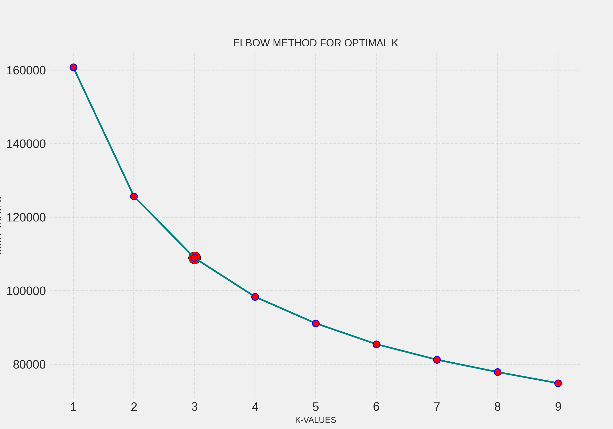
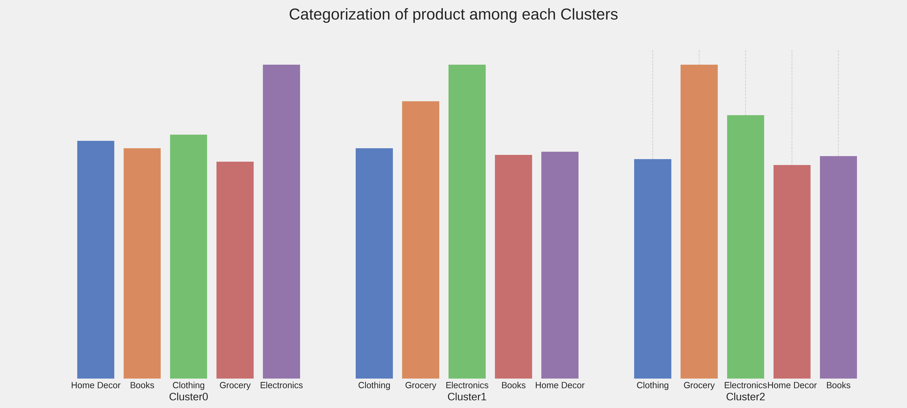
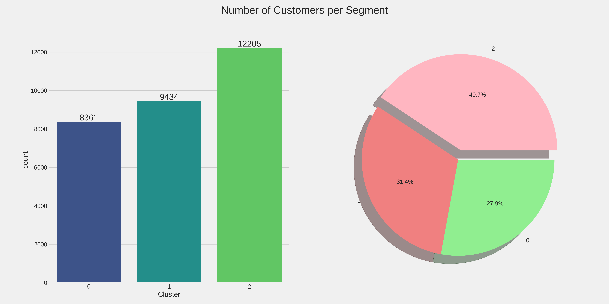

# Customer Segmentation 

## Overview
This project analyzes customer purchasing behavior using clustering techniques. The goal is to segment customers into different groups based on their spending habits, income levels, and shopping preferences. These insights help businesses tailor their marketing strategies, improve customer engagement, and optimize inventory management.

## Methodology
- **Dataset**: A retail transactional dataset containing attributes such as customer ID, age, income, purchase history, and product preferences.
- **Clustering Algorithm**: K-Prototype was used to identify patterns in customer behavior which supports both numerical and categorical features.
- **Evaluation Metrics**: Clusters were analyzed based on spending patterns, income levels, age distribution, and purchasing frequency.

## Dependencies
To run this project, install the following dependencies:
```bash
pip install numpy pandas matplotlib seaborn scikit-learn kmodes
```
- **kmodes**: Required for running K-Prototypes clustering.
- **scikit-learn**: For K-Means clustering and preprocessing.
- **pandas**: Data manipulation and analysis.
- **numpy**: Numerical computations.
- **matplotlib & seaborn**: Data visualization.

## Data Sources
The dataset used for this project comes from Kaggle, available at:
🔗 Retail Analysis - Large Dataset

### Dataset Description:-
This dataset contains retail customer data with a total size of 85MB. It includes detailed transactional records, customer demographics, and purchase behavior, making it suitable for customer segmentation, trend analysis, and business insights.

## Cluster Insights


## Optimal K value by elbow method


## Customer Segmentation Clusters

### Cluster 0: Medium Spenders (Frequent Buyers)
 - Represents 27% of customers
 - Spending Pattern: Medium spenders
 - Income Level: Low-income group
 - Top Purchased Category: Electronics
 - Age Distribution: Mixed-aged customers
 - Buying Behavior: Frequent buyers with consistent purchases

### Cluster 1: High Spenders (Irregular Buyers)
 - Represents 31% of customers
 - Spending Pattern: High spenders
 - Income Level: Medium-income group
 - Top Purchased Category: Electronics
 - Age Distribution: Mixed-aged customers
 - Buying Behavior: Not frequent buyers but make high-value purchases

### Cluster 2: Budget Shoppers (Frequent Buyers)
 - Represents 40% of customers
 - Spending Pattern: Low spenders
 - Income Level: Medium-income group
 - Top Purchased Category: Grocery items
 - Age Distribution: Mostly young customers
 - Buying Behavior: Frequent buyers who shop within a budget

## Cluster based on categories


## Customer's per Segment


## Conclusion
This segmentation analysis provides valuable insights for strategic decision-making in retail businesses. By understanding different customer behaviors, companies can enhance their marketing, optimize inventory, and improve overall customer experience.

